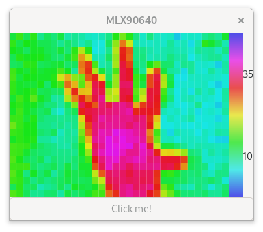

# Basic GTK app for MLX90640

** This is in very early stages **

Currently this expects a FT232h-based ftdi board to be connected to a MLX9064
board; The FTDI board is expect to have serial number "mlx90640", which can be
set with eg. ftconf.py

For my testing i'm using:
* [Adafruit FT232 breakout](https://www.adafruit.com/product/2264)
* [Adafruit MLX90640 breakout](https://www.adafruit.com/product/4407)

